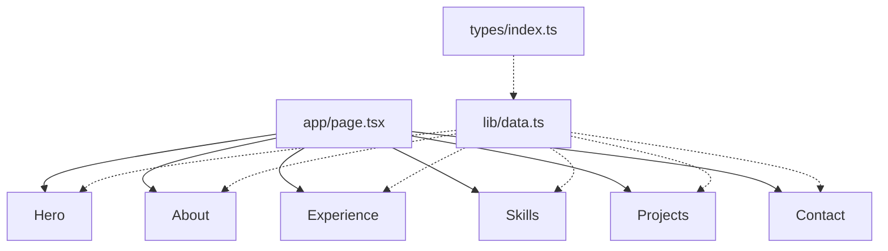
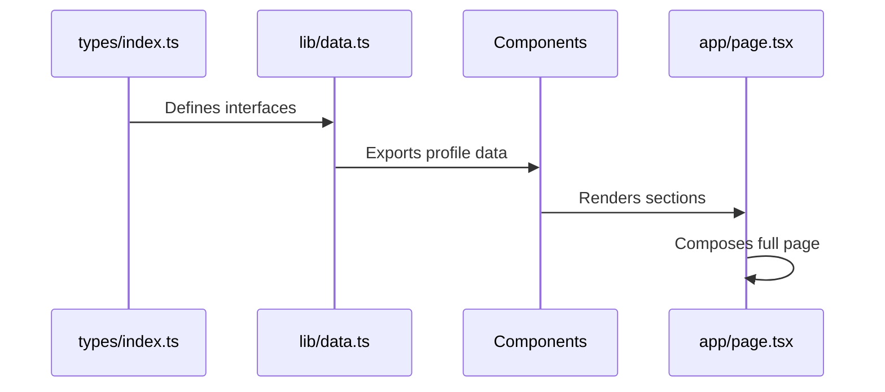
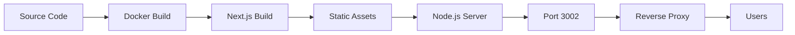

# Architecture - vibe-profile-site

## Overview

Static profile website built with Next.js 14 App Router, featuring a single-page layout with smooth scroll sections and Framer Motion animations.

## Component Hierarchy



## Data Flow



## Directory Structure

```
vibe-profile-site/
├── .agents/                    # AI agent skills and configurations
│   └── skills/                 # Specialized AI skills
├── public/                     # Static assets
│   └── images/                 # Profile images
├── src/
│   ├── app/                    # Next.js App Router
│   │   ├── layout.tsx          # Root layout + metadata
│   │   ├── page.tsx            # Main page composition
│   │   └── globals.css         # Global styles + Tailwind
│   ├── components/             # React components
│   │   ├── Hero.tsx            # Hero section
│   │   ├── About.tsx           # About section
│   │   ├── Experience.tsx      # Experience timeline
│   │   ├── Skills.tsx          # Skills grid
│   │   ├── Projects.tsx        # Projects showcase
│   │   └── Contact.tsx         # Contact section
│   ├── lib/                    # Utilities and data
│   │   └── data.ts             # Profile data (SINGLE SOURCE OF TRUTH)
│   └── types/                  # TypeScript definitions
│       └── index.ts            # Type interfaces
├── Dockerfile                  # Production Docker build
├── Dockerfile.dev              # Development Docker build
├── docker-compose.yml          # Docker orchestration
├── next.config.js              # Next.js configuration
├── tailwind.config.ts          # Tailwind CSS configuration
├── tsconfig.json               # TypeScript configuration
├── package.json                # Dependencies and scripts
└── README.md                   # Project overview
```

## Technology Stack

| Layer | Technology | Purpose |
|-------|-----------|---------|
| Framework | Next.js 14 | React framework with App Router |
| Language | TypeScript 5 | Type safety |
| Styling | Tailwind CSS 3 | Utility-first CSS |
| Animations | Framer Motion 11 | Motion components |
| Icons | Lucide React | Icon library |
| Deployment | Docker | Containerization |

## Component Contracts

### Hero
- **Purpose:** Display profile header with photo, name, title, and CTAs
- **Data Source:** `profile` object from `data.ts`
- **Key Features:** Profile photo, name, title, location, GitHub/LinkedIn/Email buttons
- **Animations:** Fade in + slide up

### About
- **Purpose:** Bio, education, and certifications
- **Data Source:** `profile.summary`, `education`, `certifications` from `data.ts`
- **Layout:** Two columns on desktop, stacked on mobile
- **Animations:** Stagger fade-in

### Experience
- **Purpose:** Work history timeline
- **Data Source:** `experiences[]` array from `data.ts`
- **Layout:** Vertical timeline with company logos (optional)
- **Animations:** Slide in from left/right alternating

### Skills
- **Purpose:** Skills grid categorized by type
- **Data Source:** `skills[]` array from `data.ts`
- **Categories:** mobile, backend, other
- **Layout:** Responsive grid (2 cols mobile, 3 cols tablet, 4 cols desktop)

### Projects
- **Purpose:** Project showcase
- **Data Source:** `projects[]` array from `data.ts`
- **Layout:** Featured projects first, then grid
- **Features:** GitHub links, tech stack tags

### Contact
- **Purpose:** Contact call-to-action
- **Data Source:** `profile.email`, `profile.linkedin`, `profile.github`
- **Features:** Email, LinkedIn, GitHub buttons
- **Animations:** Fade in + scale

## State Management

**No global state management needed** - this is a static site.

- All data is static (loaded from `data.ts`)
- No user-generated content
- No API calls
- No client-side state

## Styling Architecture

### Design Tokens (in `globals.css`)
```css
:root {
  --background: #0a0a0a;      /* Dark background */
  --foreground: #ededed;      /* Light text */
  --primary: #0070f3;         /* Primary accent */
  --secondary: #666666;       /* Secondary text */
  --border: #333333;          /* Border color */
}
```

### Tailwind Configuration
- Custom colors mapped to CSS variables
- Responsive breakpoints: sm (640px), md (768px), lg (1024px), xl (1280px)
- Default dark mode (no light mode toggle)

## Performance Optimizations

1. **Static Generation:** All content is static, pre-rendered at build time
2. **Image Optimization:** Using Next.js Image component (when images added)
3. **Code Splitting:** Automatic by Next.js App Router
4. **Tree Shaking:** Unused code eliminated in production build
5. **CSS Purging:** Tailwind removes unused utilities

## Deployment Architecture



### Docker Flow
1. `Dockerfile` builds Next.js production image
2. `docker-compose.yml` orchestrates container
3. Exposes port 3002 on homelab network
4. Accessible at http://192.168.0.106:3002

## Security Considerations

- ✅ No backend (no attack surface)
- ✅ No user input (no XSS risk)
- ✅ No database (no SQL injection)
- ✅ Static content only
- ⚠️ External links (GitHub, LinkedIn) - open in new tab with `rel="noopener"`

## Accessibility

- Semantic HTML (section, h1-h6, ul/li)
- Alt text on images (when added)
- Keyboard navigation support
- Focus states on interactive elements
- `prefers-reduced-motion` support for animations

## Browser Support

- Chrome (latest)
- Firefox (latest)
- Safari (latest)
- Edge (latest)
- Mobile browsers (iOS Safari, Chrome Mobile)

## Future Extensibility

### Easy to Add
- [ ] Blog section (add to `data.ts` + new component)
- [ ] Testimonials section
- [ ] Download resume button
- [ ] Theme toggle (light/dark mode)
- [ ] Multi-language support

### Requires More Work
- [ ] Contact form (needs backend)
- [ ] Analytics integration
- [ ] CMS integration (Sanity, Contentful)
- [ ] Dynamic OG images
